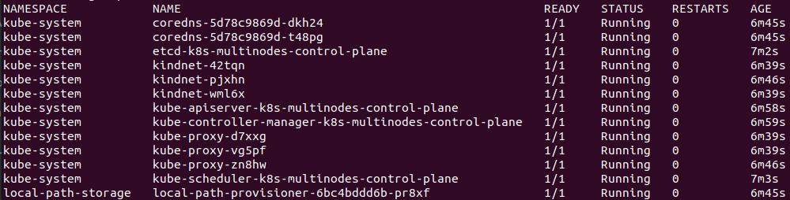

# DAY-1

# Kubernetes

### Container Engine

> [!NOTE]  
Antes de começar a falar um pouco mais sobre o Kubernetes, nós primeiro precisamos entender alguns componentes que são importantes no ecossistema do Kubernetes, um desses componentes é o Container Engine.  

O **Container Engine** é o responsável por gerenciar as imagens e volumes, é ele o responsável por garantir que os os recursos que os containers estão utilizando está devidamente isolados, a vida do container, storage, rede, etc.

Hoje temos diversas opções para se utilizar como Container Engine, que até pouco tempo atrás tinhamos somente o Docker para esse papel.

Opções como o Docker, o CRI-O e o Podman são bem conhecidas e preparadas para o ambiente produtivo. O Docker, como todos sabem, é o Container Engine mais popular e ele utiliza como Container Runtime o containerd.

### Container Runtime

Para que seja possível executar os containers nos nós é necessário ter um Container Runtime instalado em cada um dos nós.

O Container Runtime é o responsável por executar os containers nos nós. Quando você está utilizando Docker ou Podman para executar containers em sua máquina, por exemplo, você está fazendo uso de algum Container Runtime, ou melhor, o seu Container Engine está fazendo uso de algum Container Runtime.  

Temos três tipos de Container Runtime:  

1. Low-level: são os Container Runtime que são executados diretamente pelo Kernel, como o runc, o crun e o runsc.
2. High-level: são os Container Runtime que são executados por um Container Engine, como o containerd, o CRI-O e o Podman.
3. Sandbox: são os Container Runtime que são executados por um Container Engine e que são responsáveis por executar containers de forma segura em unikernels ou utilizando algum proxy para fazer a comunicação com o Kernel. O gVisor é um exemplo de Container Runtime do tipo Sandbox.
4. Virtualized: são os Container Runtime que são executados por um Container Engine e que são responsáveis por executar containers de forma segura em máquinas virtuais. A performance aqui é um pouco menor do que quando temos um sendo executado nativamente. O Kata Containers é um exemplo de Container Runtime do tipo Virtualized.  

### O que é o Kubernetes?<a name="oquekubernetes"></a>

Kubernetes é uma plataforma de código aberto projetada para automatizar a implantação, escalonamento e gerenciamento de aplicativos em contêineres. Desenvolvido pelo Google e agora mantido pela Cloud Native Computing Foundation (CNCF), o Kubernetes oferece um ambiente robusto para orquestração de contêineres, permitindo que os desenvolvedores implantem, dimensionem e gerenciem aplicativos de forma eficiente e escalável em uma infraestrutura de nuvem ou local.  

Como Kubernetes é uma palavra difícil de se pronunciar - e de se escrever - a comunidade simplesmente o apelidou de k8s, seguindo o padrão i18n (a letra "k" seguida por oito letras e o "s" no final), pronunciando-se simplesmente "kates".

### Arquitetura do k8s

1. NÓS  
    - sdsdsOs nós são as máquinas físicas ou virtuais que compõem o cluster Kubernetes.
    - Cada nó executa contêineres encapsulados em pods (unidades lógicas que compartilham recursos, como armazenamento e rede).  

2. Comunicação entre Nó e Control Plane:
    - O Control Plane é o cérebro do Kubernetes, onde os principais componentes são executados.
    - Os nós se comunicam com o Control Plane para obter instruções sobre como gerenciar os contêineres.  

3. Componentes Principais do Control Plane:
    - etcd: Armazena o estado do cluster, incluindo informações sobre os nós, pods e serviços.
    - Master: É o nó onde os principais componentes do K8s são executados, como o API Server, o Controller Manager e o Scheduler.
    - API Server: Expõe a API do Kubernetes para gerenciar recursos.
    - Controller Manager: Mantém o estado desejado do sistema, como escalonamento e replicação.
    - Scheduler: Decide em qual nó um novo pod deve ser executado com base nos recursos disponíveis.  

4. Contêineres:
    - Os contêineres são unidades de implantação no Kubernetes.
    - Eles encapsulam as aplicações e suas dependências, permitindo a portabilidade e o gerenciamento eficiente.  

## Portas que devemos nos preocupar

### Control Plane


> [!NOTE]
Toda porta marcada por * é customizável, você precisa se certificar que a porta alterada também esteja aberta. 

### WORKERS


## Conceitos-chave do k8s<a name="conceitoschavesk8s"></a>

> [!NOTE]
É importante saber que a forma como o k8s gerencia os contêineres é ligeiramente diferente de outros orquestradores, como o Docker Swarm, sobretudo devido ao fato de que ele não trata os contêineres diretamente, mas sim através de pods.


Vamos conhecer alguns dos principais conceitos que envolvem o k8s a seguir:

- **Pod:** É o menor objeto do k8s. Como dito anteriormente, o k8s não trabalha com os contêineres diretamente, mas organiza-os dentro de pods, que são abstrações que dividem os mesmos recursos, como endereços, volumes, ciclos de CPU e memória. Um pod pode possuir vários contêineres;  

- **Deployment:** É um dos principais controllers utilizados. O Deployment, em conjunto com o ReplicaSet, garante que determinado número de réplicas de um pod esteja em execução nos nós workers do cluster. Além disso, o Deployment também é responsável por gerenciar o ciclo de vida das aplicações, onde características associadas a aplicação, tais como imagem, porta, volumes e variáveis de ambiente, podem ser especificados em arquivos do tipo yaml ou json para posteriormente serem passados como parâmetro para o kubectl executar o deployment. Esta ação pode ser executada tanto para criação quanto para atualização e remoção do deployment;  

- **ReplicaSets:** É um objeto responsável por garantir a quantidade de pods em execução no nó;

- **Services:** É uma forma de você expor a comunicação através de um ClusterIP, NodePort ou LoadBalancer para distribuir as requisições entre os diversos Pods daquele Deployment. Funciona como um balanceador de carga.  


## Instalando e customizando o Kubectl<a name="installkubectl"></a>

- Instalação do Kubectl no GNU/Linux

```
curl -LO https://storage.googleapis.com/kubernetes-release/release/`curl -s https://storage.googleapis.com/kubernetes-release/release/stable.txt`/bin/linux/amd64/kubectl

chmod +x ./kubectl

sudo mv ./kubectl /usr/local/bin/kubectl

kubectl version --client
```  

Para ver outras formas de instalação em outros Sistemas operacionais veja [aqui](https://kubernetes.io/docs/tasks/tools/)

### Customizando o kubectl

- Auto-complete

No Bash:
```
# configura o autocomplete na sua sessão atual (antes, certifique-se de ter instalado o pacote bash-completion).  

$ source <(kubectl completion bash) 

# add autocomplete permanentemente ao seu shell.  

$ echo "source <(kubectl completion bash)" >> ~/.bashrc 
```

No ZSH:
```
$ source <(kubectl completion zsh)

$ echo "[[ $commands[kubectl] ]] && source <(kubectl completion zsh)"
```  


## Criando um cluster Kubernetes<a name="criandoclusterkubernetes"></a>

### Criando o cluster em sua máquina local

Para o noso estudo vamos instalar o **Kind(Kubernetes in Docker)**

- Instalação no GNU/Linux

```
curl -Lo ./kind https://kind.sigs.k8s.io/dl/v0.14.0/kind-linux-amd64

chmod +x ./kind

sudo mv ./kind /usr/local/bin/kind
```

Para ver outras formas de instalação em outros Sistemas operacionais veja [aqui](https://kind.sigs.k8s.io/docs/user/quick-start/)


### Criando um cluster com o Kind

Para nosso estudo vamos Criar um arquivo de configuração para definir quantos e o tipo de nós no cluster que você deseja. No exemplo a seguir, será criado o arquivo de configuração **kind-3nodes.yaml** para especificar um cluster com 1 nó control-plane (que executará o control plane) e 2 workers.

```
vim kind-3nodes.yaml
```
Escreva ou copie e cole as linhas abaixo no arquivo criado: 
```
kind: Cluster
apiVersion: kind.x-k8s.io/v1alpha4
nodes:
  - role: control-plane
  - role: worker
  - role: worker
```  

Agora vamos criar um cluster chamado **k8s-multinodes** utilizando as especificações definidas no arquivo **kind-3nodes.yaml.**

```
kind create cluster --name k8s-multinodes --config kind-3nodes.yaml
```


- Para visualizar o clusters utilizando o kind, execute o comando a seguir.
```
$ kind get clusters
```

- Listando os nodes do cluster com o **kubectl**.  
```
$ kubectl get nodes
```  


- Excluindo o cluster.
> [!note]
Não exclua o cluster agora, vamos dar seguimento nos estudos. Ao terminar fique a vontade para faze-lo.
```
kind delete cluster -n k8s-multinodes
```


## Primeiros passos no k8s<a name="primeirospassok8s"></a>

### Verificando os namespaces e pods

O k8s organiza tudo dentro de namespaces. Por meio deles, podem ser realizadas limitações de segurança e de recursos dentro do cluster, tais como pods, replication controllers e diversos outros. Para visualizar os namespaces disponíveis no cluster, digite:

```
$ kubectl get namespaces
```


Vamos listar os pods do namespace kube-system utilizando o comando a seguir.

```
kubectl get pod -n kube-system
```


Também é possível listar todos os pods de todos os namespaces com o comando a seguir.

```
kubectl get pods -A
```


Há a possibilidade ainda, de utilizar o comando com a opção -o wide, que disponibiliza maiores informações sobre o recurso, inclusive em qual nó o pod está sendo executado. Exemplo:

```
kubectl get pods -A -o wide
```


## Executando nosso primeiro pod no k8s<a name="primeiropodl8s"></a>

Iremos iniciar o nosso primeiro pod no k8s. Para isso, executaremos o comando a seguir.

```
$ kubectl run nginx --image nginx
```


Listando os pods com kubectl get pods, obteremos a seguinte saída.

```
$ kubectl get pods
```


Vamos agora remover o nosso pod com o seguinte comando.

```
$ kubectl delete pod nginx
```


### Outra forma de executar o pod no k8s

Uma outra forma de criar um pod ou qualquer outro objeto no Kubernetes é através da utilizaçâo de uma arquivo manifesto, que é uma arquivo em formato YAML onde você passa todas as definições do seu objeto. Mas pra frente vamos falar muito mais sobre como construir arquivos manifesto, mas agora eu quero que você conheça a opção --dry-run do kubectl, pos com ele podemos simular a criação de um resource e ainda ter um manifesto criado automaticamente.  

### criando um template de um pod:

```
kubectl run meu-nginx --image nginx --dry-run=client -o yaml > pod-template.yaml
```  

- Acima estamos utilizando o parametro '-o', utilizado para modificar a saída para um arquivo template de um deployment com o formato YAML.  

Com o arquivo, agora você consegue criar um pod utilizando o manifesto que criamos da seguinte forma:  

```
kubectl apply -f pod-template.yaml
```


O parâmetro **apply** do kubectl é usado para aplicar um arquivo de configuração ou uma especificação de recursos Kubernetes a um cluster Kubernetes. Ele permite criar, atualizar ou remover recursos no cluster com base nas definições fornecidas no arquivo de configuração.

Ao usar o **kubectl apply**, o Kubernetes verifica o estado atual dos recursos no cluster e aplica as alterações necessárias para garantir que o estado correspondente ao especificado no arquivo de configuração seja alcançado. Isso significa que ele pode criar novos recursos, atualizar os existentes para corresponder ao arquivo de configuração ou remover aqueles que não estão mais presentes na definição.

O kubectl apply é especialmente útil porque é idempotente, o que significa que pode ser executado várias vezes sem efeitos colaterais indesejados. Ele se adapta ao estado atual do cluster e aplica apenas as alterações necessárias para alcançar o estado desejado conforme descrito no arquivo de configuração. Isso simplifica o processo de gerenciamento e implantação de recursos no Kubernetes.


## Expondo o pod e criando um Service

Os dispositivos externos ao cluster, por padrão, não têm acesso aos pods criados, diferentemente do que ocorre em outros sistemas de contêineres.  

Antes de expor o pod, vamos exclui-lo:
```
$ kubectl delete pod meu-nginx
```

Vamos alterar o template yaml adicionando a porta que queremos expor o pod com o parâmetro **--port**.  

Execute o seguinte comando:
```
kubectl run meu-nginx --image nginx --port 80 --dry-run=client -o yaml > pod-template.yaml
```

Aplique o template com o seguinte comando:
```
kubectl apply -f pod-template.yaml
```

Liste os pods:

```
kubectl get pods
```


Agora vamos expor de verdade, criando um **Service** que é utilizado justamente para expor pods para acesso externo.

O comando a seguir cria um objeto do k8s chamado de Service
```
kubectl expose pod meu-nginx
```


Podemos listar todos os services com o comando a seguir.
```
kubectl get services
```


- Observe na imagem acima, que há dois services no nosso cluster: o primeiro é para uso do próprio k8s, enquanto o segundo foi o quê acabamos de criar.  

## Finalizando o nosso estudo

```
kubectl delete -f pod-template.yaml
```
```
kubectl delete service meu-nginx
```
 Exclua também o cluster k8s
 ```
 kind delete cluster -n k8s-multinodes
 ```

 # FUI!!!!